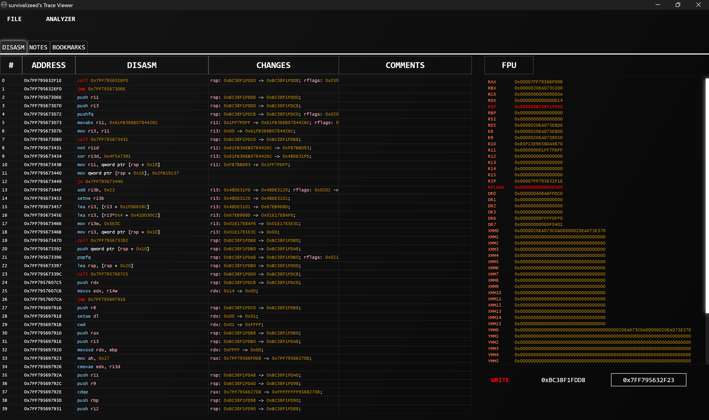
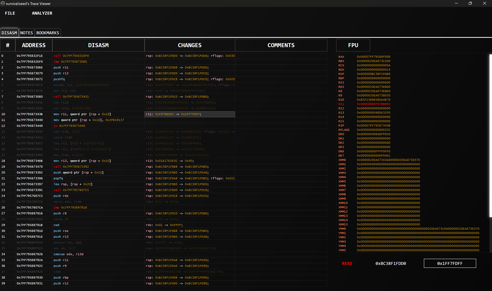
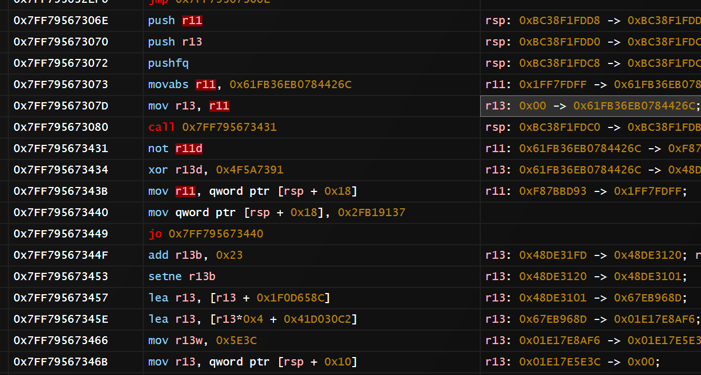
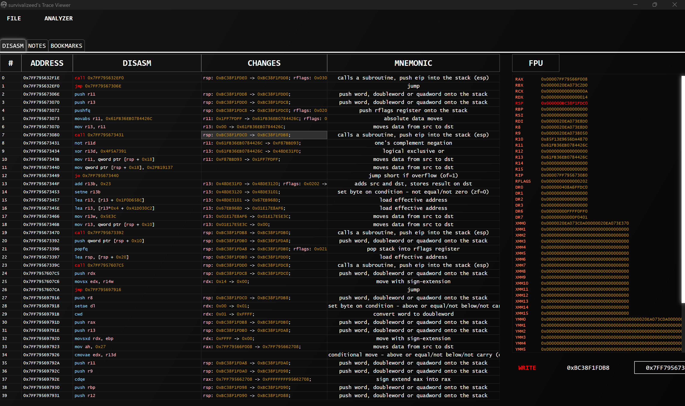
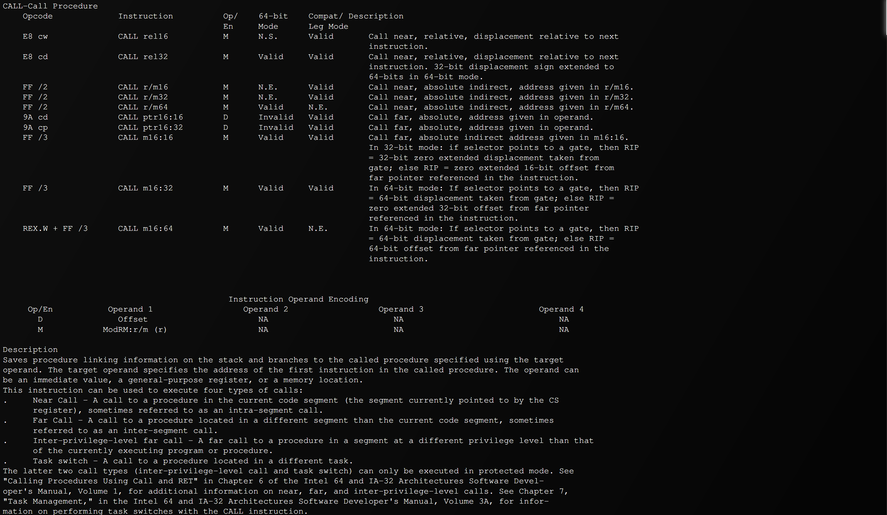
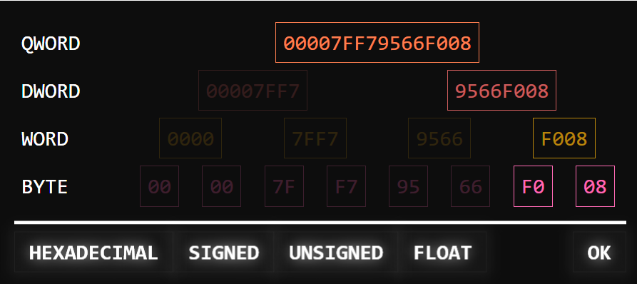
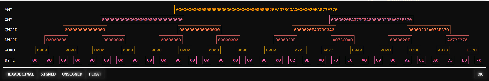

# Trace Viewer

**Inspect, Analyze, and Deobfuscate x64dbg Trace Files with Ease.**

Trace Viewer is a modern, powerful and user-friendly tool, developed using C# WPF, designed to help you effectively examine and understand trace files generated by the x64dbg debugger. Whether you're reverse-engineering malware, analyzing complex software, virtualized code, or simply trying to understand program execution flow, this viewer provides the features you need to gain valuable insights.  

This Repository is an early stage so bugs are expected

## UI & Features

### Automatic Useless Assignment Detection (Beta)

### Highlighting

### Mnemonic help

### Data Visualization

## Contributing

I welcome contributions from the community! If you have ideas for new features, bug fixes, or improvements, please feel free to:

1.  Fork the repository.
2.  Create a new branch for your changes.
3.  Make your changes and commit them.
4.  Push your changes to your fork.
5.  Submit a pull request.

Please ensure your C# code adheres to the project's coding style.

## License

This project is licensed under the [GPL-3.0 license](LICENSE). See the `LICENSE` file for more information.

## Credits
To x64dbg and the docs and the creator of the Execution Trace Viewer

## Author

[survivalizeed](https://github.com/survivalizeed)
